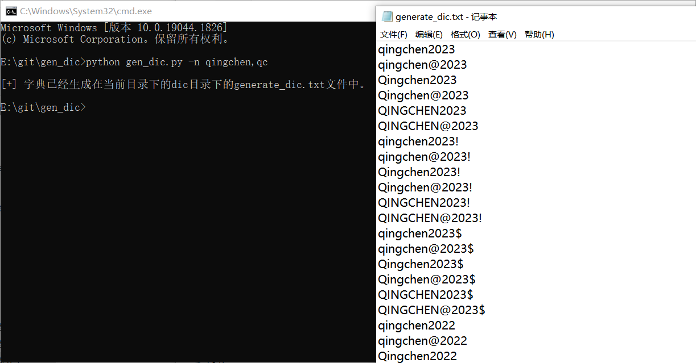

# 工具介绍

再渗透中，其实遇到的目标密码其实大多都是，单位或者系统名称或者其他名称，然后后面跟上年份或者其他字符。

比如：`Qingchen@2023`、`Qingchen@123`之类的。

或者结尾再加个特殊符号，比如`Qingchen@2023!`、`Qingchen@123.`

为了方便拼接出字典，再根据拼接的字典组合再平时经常使用的密码字典中，组成新的字典；就写了这个小工具。

嘛这个工具很简单啦。就是根据名字和简称简单做拼接生成一个小字典。没啥亮点。

可以自己改啦，感觉字典少了就改一下base_passwd.txt的字典。

如果是连接符不是@符号的，可以自己指定一个，调用的时候，就自己改一个。

反正比较垃圾。

# 工具的使用

-n 或者 --name 指定名字，可以有多个，逗号隔开，必须参数！

如：

``` python
python gen_dic.py -n qingchen,qc
```



