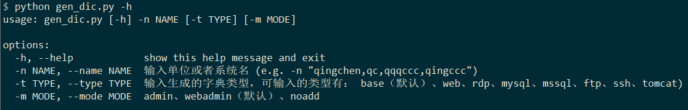
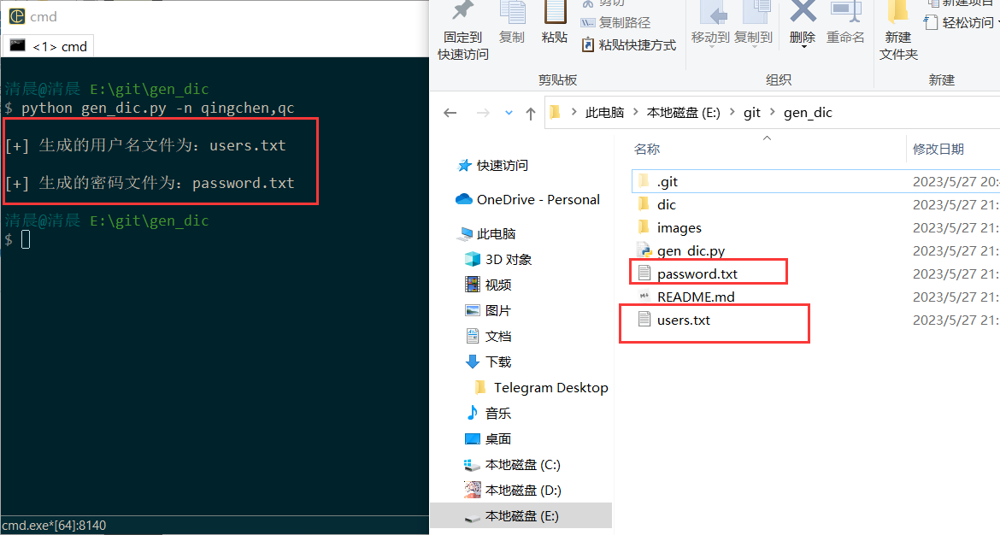
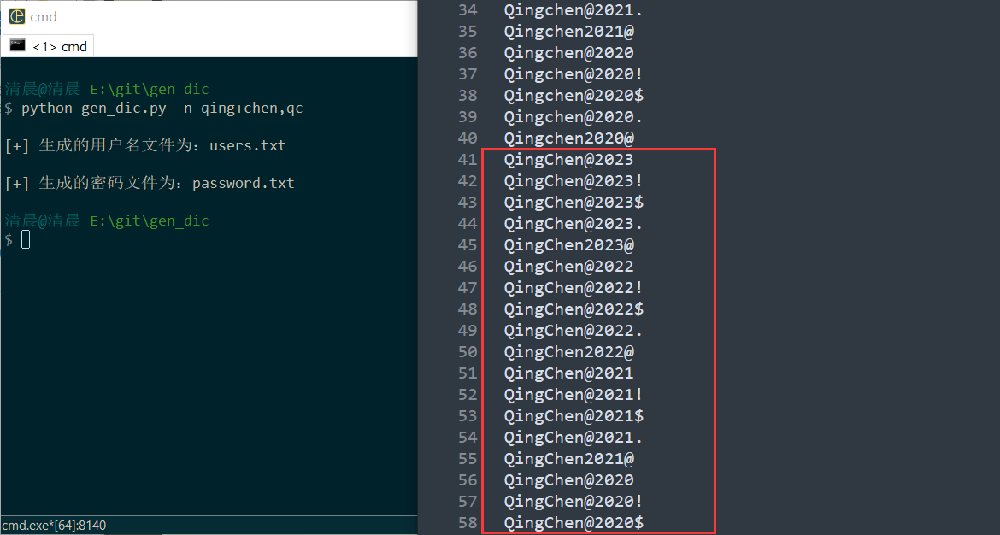
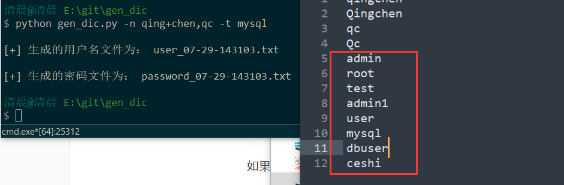

# 1. 工具介绍

**垃圾字典生成器！！！改了多次依然觉得不是很满意，凑合着用吧。**

**主要正对企业环境，非企业环境的话还是建议换工具吧**

## 1.1 工具的由来

> 在渗透中，其实遇到的目标密码大多都是，单位或者系统名称或者其他名称，然后后面跟上年份或者其他字符，比如：`Qingchen@2023`、`Qingchen@123`之类的。
> 
> 或者结尾再加个特殊符号，比如`Qingchen@2023!`、`Qingchen@123.`
> 
> 为了方便拼接出字典，再根据拼接的字典组合再平时经常使用的密码字典中，组成新的字典；就写了这个小工具。
> 
> 嘛这个工具很简单啦。就是根据名字和简称简单做拼接生成一个小字典。没啥亮点。
> 
> 当然啦。自己改啦，感觉字典少了就改一下base_passwd.txt的字典。
> 
> base_passwd.txt的使用规律，把连接如果加入的字典有在连接字符中或者末尾字符中就去掉，比如`1$`，这个`$`因为是末尾就可以去掉，写`1`在base_passwd.txt
> 
> 因为$已经是末尾字符了，生成的密码会生成`1$`的可能，没有加的必要
> 
> 针对国内，对国外的爆破应该并不太友好，比如你拿去打国外的靶机，应该很少能爆破出来。

## 1.2 工具更新历程

+ 这个工具最原始的想法就是，几个for循环拼接一下年份之类的生成一个字典就用了。

+ 后面又感觉没有单词边界加入了+号连接的输入方式。

+ 再后来发现有些管理用户可能就是系统名或者系统名_admin之类的，就干脆用户字典也生成一下。

+ 再再后来感觉字典每种类型的服务的字典都不一样的，不能统一用一个，就开始拆分用户字典。

+ 再再再后来感觉自己有时候懒不喜欢生成，会第一时间先用password字典来跑，跑完跑不出来才来生成，但是生成的字典会默认把password的字典拼接到最后；我已经跑过一次了不想拼接了。就搞了一个新的选项，noadd是不拼接。

+ 最后发现，哎怎么不对啊，这普通用户的密码和admin的密码是不一样的，普通用户的密码里怎么可能会有admin@123这种管理员的密码呢？而且管理员的密码特别是企业环境种怎么可能会有loveyou这种密码呢。于是就又拆了一下密码字典。

+ 总的来说就是一个垃圾东西反复折腾，目前为止还是觉得不是那么满意。

最后放一个衍生项目：

**衍生项目（字典规律收集和命中率测试）的代码：**[字典收集测试](https://github.com/qingchenhh/Simple-dictionary-generator/tree/main/pass_test)

---

## 1.3 字典推荐

最后依照惯例推荐一些好用的字典：

> PentesterSpecialDict：https://github.com/a3vilc0de/PentesterSpecialDict
>
> Dictionary-Of-Pentesting：https://github.com/insightglacier/Dictionary-Of-Pentesting
>
> Web-Fuzzing-Box：https://github.com/gh0stkey/Web-Fuzzing-Box
>
> SuperWordlist：https://github.com/CrackerCat/SuperWordlist
>
> fuzzDicts：https://github.com/TheKingOfDuck/fuzzDicts
>
> Fuzz_dic：https://github.com/7hang/Fuzz_dic

# 2. 使用tips

1. dic目录下的字典都可以单独使用，如果有些网站不想通过python脚本根据名称生成字典也可以直接独立使用。

2. 特别是用户字典，比如tomcat的字典或者是ssh这些服务类的用户名其实很少是名称+admin之类的，但是为了以防万一还是生成了一个，但是其实大部分情况下还是直接用最好，用户少爆破快。

3. 渗透中实在没有突破口的时候，而且没有那种很安全的验证码的时候，就是需要跑全一点花点时间也没关系，这时候**生成的字典也跑不出来密码**，可以尝试上面推荐的密码，然后搞个top1万，或者top2万。

# 3. 工具的使用

用法就是`-h`选项看一下。



## 3.1 常规使用

1. ` -n `或者` --name `指定名字，可以有多个，逗号隔开，必须参数！如：

``` python
python gen_dic.py -n qingchen,qc
```



2. 以上程序运行`qingchen`的结果只能是要么全大写要么首字母大写，但是想要得到`QingChen`的`Chen`首字母大写做不到，因为不知道单词的边界是哪里，这时候就可以使用字符连接符`+`如：

```
python gen_dic.py -n qing+chen,qc
```



## 3.2 拼接模式

先说点废话：
+ 因为字典的原理就是拼接年份之类的生成最后再拼接一个我自己搞的常见密码字典，但是对于web站点的爆破来说，管理员用户是基本上不会使用什么`loveyou`，`5201314`之类的密码的，特别是**企业环境**，所以做了一下优化去掉了这些密码.

+ 而管理员的密码又分为web的和非web的，我这里分的不细，只是把web的大致提出来了，非web的就都乱七八糟的放在了`admin_password.txt`字典中。

+ 再然后就是普通业务用户，比如oa的个人账号，这些也不太可能出现`loveyou`之类的密码也去掉了，用户字典建议使用常见**中文姓名拼音TOP500**的字典，密码就用`webuser_password.txt`那个字典，可以根据自己需求修改，普通用户的密码是没必要生成的，因为普通用户的密码不可能出现`admin@123`这类的密码，常识一些简单的`123456`、`000000`之类的就行了。

`-m`选项的参数如下：

+ admin：该模式就是使用dic目录下面的admin_password.txt进行拼接。
+ webadmin（默认）：该模式就是使用dic目录下面的webadmin_password.txt
+ noadd：不拼接。

## 3.3 指定用户字典类型

如果要生成其他用户名的字典就用`-t`指定。比如，要生成mysql的用户。

```
python gen_dic.py -n qing+chen,qc -t mysql
```


