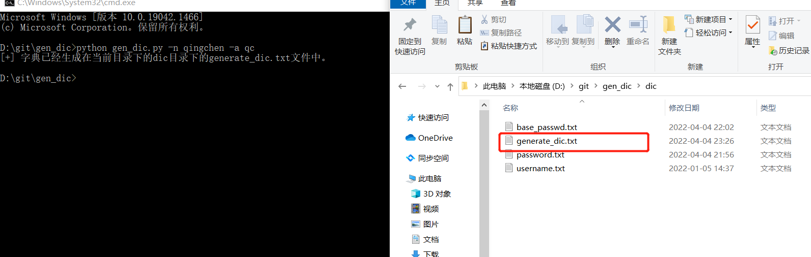

# 工具介绍

嘛这个工具很简单啦。就是根据名字和简称简单做拼接生成一个小字典。

没啥亮点，唯一亮点就是字典是我自己搞的。

可以自己改啦，感觉字典少了就改一下base_passwd.txt的字典。

如果是连接符不是@符号的，可以自己指定一个，调用的时候，就自己改一个。

反正比较垃圾。

# 工具的使用

-n 或者 --name 指定名字，必须参数！

-a 或者 --abbreviation 指定简称，非必须参数。

如：

``` python
python gen_dic.py -n qingchen [-a] [qc]
```



