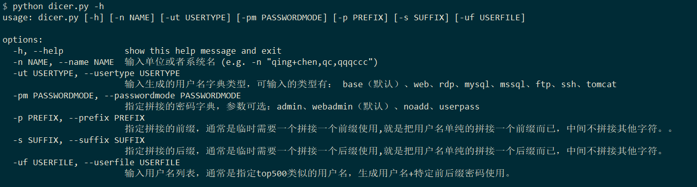
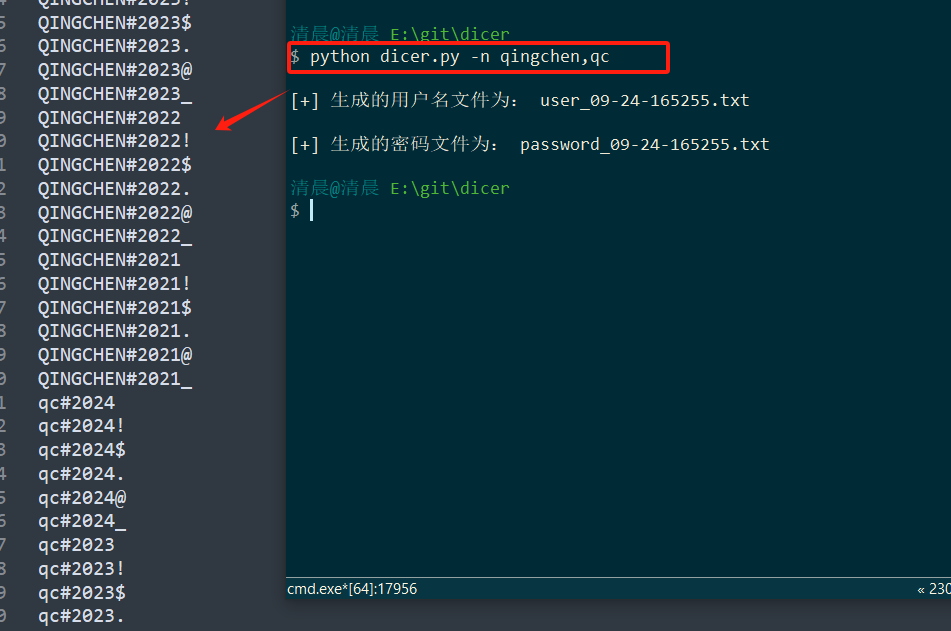
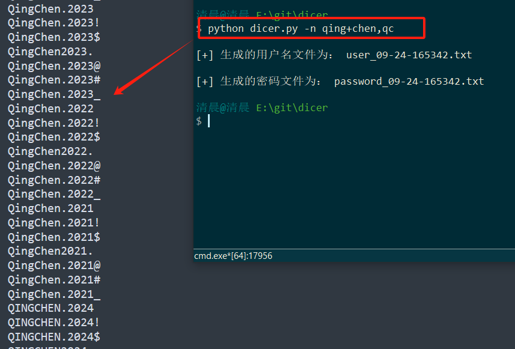
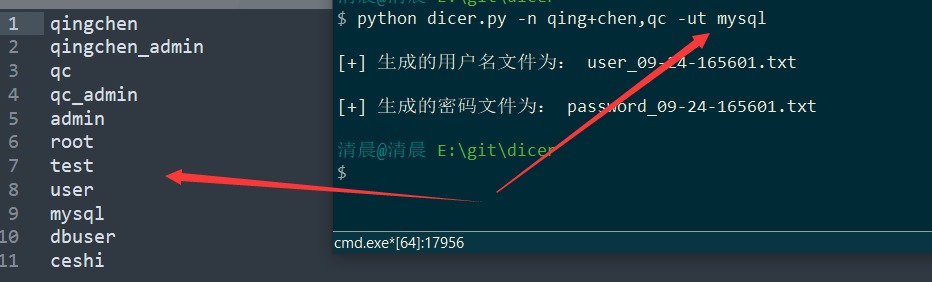
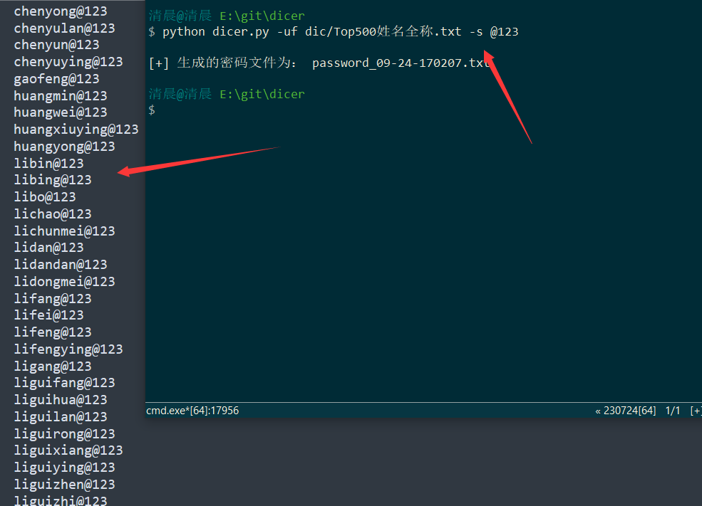

# 1. 前言

**改了多次依然觉得不是很满意，凑合着用吧。**

**主要针对企业环境，非企业环境的话还是建议换工具吧**

**密码字典可能会经常更新一些密码，建议下载使用最新的字典**

## 1.1 使用tips

1. **dic目录下的字典都可以单独使用**，如果有些网站不想通过python脚本根据名称生成字典也可以直接独立使用。

2. 特别是用户字典，比如tomcat的字典或者是ssh这些服务类的用户名其实很少是名称+admin之类的，但是为了以防万一还是生成了一个，但是其实部分情况下还是直接用最好，用户少爆破快。

3. 渗透中实在没有突破口的时候，而且没有那种很安全的验证码的时候，就是需要跑全一点花点时间也没关系，**生成的字典也跑不出来密码**，这时候如果你担心我字典不够全，那么你就可以尝试下面推荐的密码字典。

4. 事实上除了尝试爆破密码，还可以尝试去找系统的默认密码，有可能系统存在默认密码，我这个项目也放了一个我自己搜集的，里面也有一些默认密码推荐。

## 1.2 工具的优势

1. 自己整理尽可能小而全的字典，dic目录下是整理好的字典可以单独使用。
2. 主要针对企业环境做了各种连接和末尾特殊字符的拼接，尽可能全的生成字典。
3. 生成的字典包含admin@2024、test@2024等，admin@【年份】类型的字典生成。
4. 生成的字典包含admin@h3c这样的，admin@【单位名】类型的字典生成。
5. 可以生成lisi@123、wangwu@123等，【姓名拼音全称】+【统一前后缀的】的普通用户的密码。

## 1.3 字典推荐

最后依照惯例推荐一些好用的字典：

> PentesterSpecialDict：https://github.com/a3vilc0de/PentesterSpecialDict
>
> Dictionary-Of-Pentesting：https://github.com/insightglacier/Dictionary-Of-Pentesting
>
> Web-Fuzzing-Box：https://github.com/gh0stkey/Web-Fuzzing-Box
>
> SuperWordlist：https://github.com/CrackerCat/SuperWordlist
>
> fuzzDicts：https://github.com/TheKingOfDuck/fuzzDicts
>
> Fuzz_dic：https://github.com/7hang/Fuzz_dic

# 2. 工具的使用

用法就是`-h`选项看一下。

```
$ python dicer.py -h
usage: dicer.py [-h] [-n NAME] [-ut USERTYPE] [-pm PASSWORDMODE] [-p PREFIX] [-s SUFFIX] [-uf USERFILE]

options:
  -h, --help            show this help message and exit
  -n NAME, --name NAME  输入单位或者系统名 (e.g. -n "qing+chen,qc,qqqccc")
  -ut USERTYPE, --usertype USERTYPE
                        输入生成的用户名字典类型，可输入的类型有： base（默认）、web、rdp、mysql、mssql、ftp、ssh、tomcat
  -pm PASSWORDMODE, --passwordmode PASSWORDMODE
                        指定拼接的密码字典，参数可选：admin、webadmin（默认）、noadd、userpass
  -p PREFIX, --prefix PREFIX
                        指定拼接的前缀，通常是临时需要一个拼接一个前缀使用,就是把用户名单纯的拼接一个前缀而已，中间不拼接其他字符。。
  -s SUFFIX, --suffix SUFFIX
                        指定拼接的后缀，通常是临时需要一个拼接一个后缀使用,就是把用户名单纯的拼接一个后缀而已，中间不拼接其他字符。
  -uf USERFILE, --userfile USERFILE
                        输入用户名列表，通常是指定top500类似的用户名，生成用户名+特定前后缀密码使用。
```



## 2.1 最基础的使用

1. ` -n `或者` --name `指定单位或者系统名，可以有多个，逗号隔开，必须参数！如：

``` python
python dicer.py -n qingchen,qc
```



2. 以上程序运行`qingchen`的结果只能是要么全大写要么首字母大写，但是想要得到`QingChen`的`Chen`首字母大写做不到，因为不知道单词的边界是哪里，这时候就可以使用字符连接符`+`如：

```
python dicer.py -n qing+chen,qc
```



## 2.2 拼接模式

`-pm`选项的参数如下：

+ admin：该模式就是使用dic目录下面的admin_password.txt进行拼接（admin的密码相较于webadmin的密码去掉了`admin' or 1=1 --+`这样属于web的密码，多了一些ubuntu、Talent!23、sa123等其他密码。）。
+ webadmin（默认）：该模式就是使用dic目录下面的webadmin_password.txt。
+ noadd：不拼接。


## 2.3 指定用户字典类型

如果要生成其他用户名的字典就用`-ut`指定，可选类型： base（默认）、web、rdp、mysql、mssql、ftp、ssh、tomcat。生成mysql的用户字典：

```
python dicer.py -n qing+chen,qc -ut mysql
```



## 2.4 生成普通用户的字典

如果要生成比如常用top500全称中文拼音，有些密码是`【用户名】123`这样的字典，那么密码每个用户的密码都是不同的，都是自己的`【用户名】123`，就使用`-uf`参数来生成，比如某系统，默认密码是`【用户名】@123`，就可以使用`-s`参数来指定后缀，前缀同理。

```
python dicer.py -uf dic/Top500姓名全称.txt -s @123
```



# 3 其他

---

## 3.1 工具的由来

> 在渗透中，其实遇到的目标密码大多都是，单位或者系统名称或者其他名称，然后后面跟上年份或者其他字符，比如：`Qingchen@2023`、`Qingchen@123`之类的。
> 
> 或者结尾再加个特殊符号，比如`Qingchen@2023!`、`Qingchen@123.`
> 
> 为了方便拼接出字典，再根据拼接的字典组合再平时经常使用的密码字典中，组成新的字典；就写了这个小工具。
> 
> 嘛这个工具很简单啦。就是根据名字和简称简单做拼接生成一个小字典。没啥亮点。
> 
> 当然啦。自己改啦，感觉字典少了就改一下base_passwd.txt的字典。
> 
> base_passwd.txt的使用规律，把连接如果加入的字典有在连接字符中或者末尾字符中就去掉，比如`1$`，这个`$`因为是末尾就可以去掉，写`1`在base_passwd.txt
> 
> 因为$已经是末尾字符了，生成的密码会生成`1$`的可能，没有加的必要
> 
> 主要针对国内，对国外的爆破应该并不太友好，比如你拿去打国外的靶机，应该很少能爆破出来。

## 3.2 工具更新历程

+ 这个工具最原始的想法就是，几个for循环拼接一下年份之类的生成一个字典就用了。

+ 后面又感觉没有单词边界加入了+号连接的输入方式。

+ 再后来发现有些管理用户可能就是系统名或者系统名_admin之类的，就干脆用户字典也生成一下。

+ 再再后来感觉字典每种类型的服务的字典都不一样的，不能统一用一个，就开始拆分用户字典。

+ 再再再后来感觉自己有时候懒不喜欢生成，会第一时间先用password字典来跑，跑完跑不出来才来生成，但是生成的字典会默认把password的字典拼接到最后；我已经跑过一次了不想拼接了。就搞了一个新的选项，noadd是不拼接。

+ 再再再再后来，哎怎么不对啊，这普通用户的密码和admin的密码是不一样的，普通用户的密码里怎么可能会有admin@123这种管理员的密码呢？而且管理员的密码特别是企业环境种怎么可能会有loveyou这种密码呢。于是就又拆了一下密码字典。

+ 现在发现，普通用户的密码也生成一下，比如常用top500全称中文拼音，有些密码是用户名123这样的字典，那么密码每个用户的密码都是不同的，都是自己的用户名123，然后就增加一个普通用户加前后缀生成密码的功能。

+ 总的来说就是一个垃圾东西反复折腾，目前为止还是觉得不是那么满意。

最后放一个衍生项目：

**衍生项目（字典规律收集和命中率测试）的代码：**[字典收集测试](https://github.com/qingchenhh/Simple-dictionary-generator/tree/main/pass_test)
