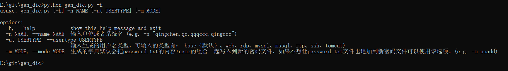
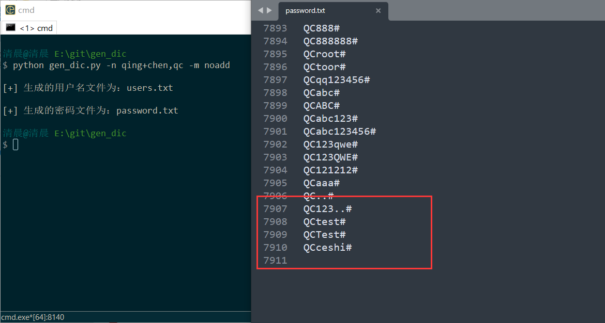
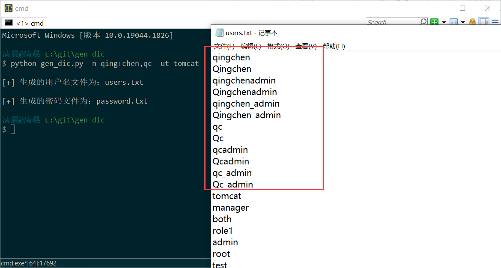

# 工具介绍

垃圾字典生成器！！！

再渗透中，其实遇到的目标密码大多都是，单位或者系统名称或者其他名称，然后后面跟上年份或者其他字符。

比如：`Qingchen@2023`、`Qingchen@123`之类的。

或者结尾再加个特殊符号，比如`Qingchen@2023!`、`Qingchen@123.`

为了方便拼接出字典，再根据拼接的字典组合再平时经常使用的密码字典中，组成新的字典；就写了这个小工具。

嘛这个工具很简单啦。就是根据名字和简称简单做拼接生成一个小字典。没啥亮点。

可以自己改啦，感觉字典少了就改一下base_passwd.txt的字典。

base_passwd.txt的使用规律，把连接如果加入的字典有在连接字符中或者末尾字符中就去掉，比如`1$`，这个`$`因为是末尾就可以去掉，写`1`在base_passwd.txt

因为$已经是末尾字符了，生成的密码会生成`1$`的可能，没有加的必要

针对国内，对国外的爆破应该并不太友好，比如你拿去打国外的靶机，应该很少能爆破出来。

**该项目的衍生项目（字典规律收集和命中率测试）：http://43.139.113.208/index.php**

---

最后依照管理推荐一些好用的字典：

>Dictionary-Of-Pentesting：https://github.com/insightglacier/Dictionary-Of-Pentesting
>
>Web-Fuzzing-Box：https://github.com/gh0stkey/Web-Fuzzing-Box
>
>SuperWordlist：https://github.com/CrackerCat/SuperWordlist
>
>fuzzDicts：https://github.com/TheKingOfDuck/fuzzDicts
>
>Fuzz_dic：https://github.com/7hang/Fuzz_dic


# 小提示

dic目录下的字典都可以单独使用，特别是password.txt，如果有些网站不想通过python脚本根据名称生成字典也可以直接独立使用。特别是用户字典，比如tomcat的字典或者是ssh这些服务类的用户名其实很少是名称+admin之类的，但是为了以防万一还是生成了一个，但是其实大部分情况下还是直接用最好，用户少爆破快。

渗透中实在没有突破口的时候，而且没有那种很安全的验证码的时候，就是需要跑全一点花点时间也没关系，这时候生成的字典也跑不出来密码，可以尝试上面推荐的密码，然后搞个top1万，或者top2万。

# 工具的使用

用法就是`-h`选项看一下就知道了。



`-n `或者` --name `指定名字，可以有多个，逗号隔开，必须参数！如：

``` python
python gen_dic.py -n qingchen,qc
```


以上程序运行`qingchen`的结果只能是要么全大写要么首字母大写，但是想要得到`QingChen`的`Chen`首字母大写做不到，因为不知道单词的边界是哪里，这时候就可以使用字符连接符`+`如：

```
python gen_dic.py -n qing+chen,qc
```


生成字典是各种组合再组合password.txt；而有时候，当我们单独使用了password.txt时，没有爆破出来，我们再想生成密码字典，因为password.txt的内容已经跑过了，就不想要追加这部分字典再生成的字典中，我们就可以使用`-m noadd`。如：

```
python gen_dic.py -n qing+chen,qc -m noadd
```



如果要生成其他用户名的字典就用`-ut`指定。比如，要生成tomcat的用户。

```
python gen_dic.py -n qing+chen,qc -ut tomcat
```


